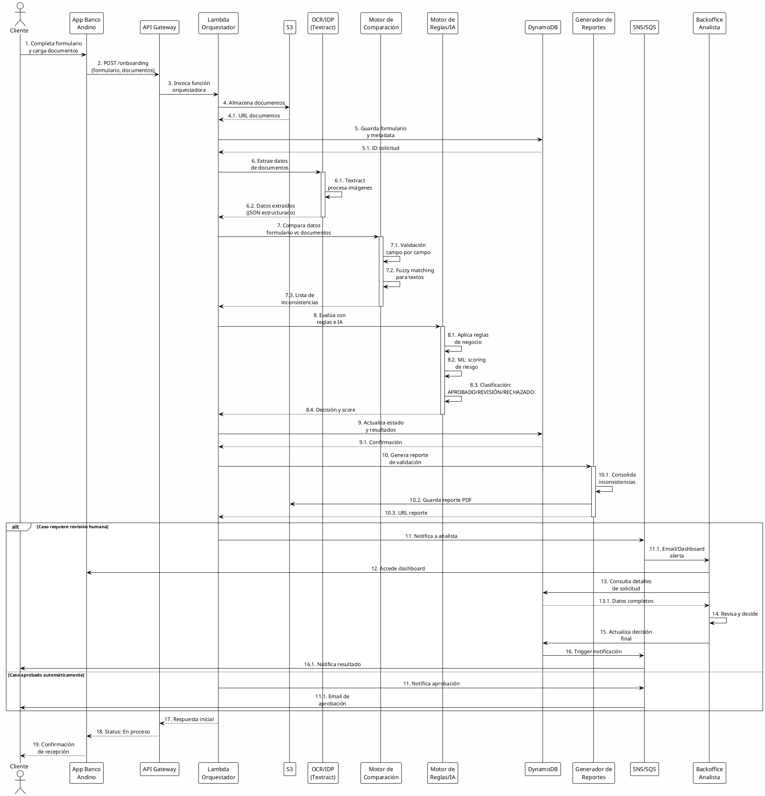

# Sistema Inteligente de Detección de Inconsistencias - Banco Andino

## 📋 Resumen Ejecutivo

Sistema automatizado para la detección de inconsistencias entre formularios digitales y documentos cargados durante el proceso de onboarding de personas naturales, utilizando servicios AWS y tecnologías de IA.

---

## 🎯 Objetivos

### Objetivos Principales
- **Mejorar la calidad de la información**: Validación automática y cruzada de datos
- **Eficiencia operativa**: Reducción de tiempos de validación de 2-3 días a minutos
- **Seguridad y cumplimiento**: Adherencia a normativas KYC, AML y SARLAFT

### Beneficios Esperados
- ✅ Reducción del 80% en errores manuales
- ✅ Disminución del 70% en tiempos de validación
- ✅ Mejora en trazabilidad y auditoría
- ✅ Reducción de riesgos de cumplimiento normativo

---

## 🏗️ Arquitectura del Sistema

### Componentes por Capas

#### 1️⃣ Capa de Cliente
- **App de Onboarding Digital**: Interfaz web/móvil para captura de datos
- **Autenticación Segura**: AWS Cognito con MFA
- **Validaciones en tiempo real**: Formato, completitud de datos

#### 2️⃣ Capa de Entrada
- **API Gateway**: Punto de entrada único y seguro
- **Validación de esquemas**: JSON Schema validation
- **Rate limiting**: Protección contra abusos

#### 3️⃣ Capa de Almacenamiento
- **Amazon S3**: 
  - Documentos originales (cédulas, RUT, estados financieros)
  - Lifecycle policies para archivado
  - Versionamiento habilitado
- **DynamoDB**:
  - Formularios digitales
  - Resultados de validaciones
  - Metadatos de procesamiento
  - Estado de solicitudes

#### 4️⃣ Capa de Procesamiento Inteligente

**Extracción de Datos (OCR/IDP)**
- **Amazon Textract**: Extracción de texto estructurado y tablas
- **Amazon Rekognition**: Detección de rostros, validación de documentos
- **Procesamiento**: Lambda functions para orquestación

**Análisis y Comprensión (NLP)**
- **Amazon Comprehend**: Análisis de entidades, sentimiento
- **Amazon SageMaker**: Modelos personalizados para:
  - Clasificación de documentos
  - Detección de anomalías
  - Scoring de riesgo

**Motor de Comparación**
- **Lambda Functions**: Lógica de comparación campo por campo
- **Reglas de validación**:
  - Coincidencia exacta (nombres, números de identificación)
  - Coincidencia aproximada (direcciones, fuzzy matching)
  - Validación de rangos (fechas, montos)

**Motor de Reglas e IA**
- **Reglas de negocio**: Validaciones configurables
- **Machine Learning**: Detección de patrones anómalos
- **Scoring de riesgo**: Clasificación automática de solicitudes

#### 5️⃣ Capa de Reportes y Alertas
- **Generador de Reportes**: Lambda + QuickSight
- **Sistema de Notificaciones**:
  - SNS para alertas críticas
  - SQS para procesamiento asíncrono
  - EventBridge para orquestación

#### 6️⃣ Capa de Revisión Humana
- **Dashboard de Analistas**: Portal web con casos pendientes
- **Workflow de aprobación**: Estados y transiciones
- **Herramientas de comparación**: Vista lado a lado

#### 7️⃣ Capa de Seguridad y Auditoría
- **IAM**: Control de acceso granular
- **KMS**: Encriptación de datos sensibles
- **CloudWatch**: Logs y métricas
- **CloudTrail**: Auditoría de acciones
- **AWS Config**: Cumplimiento de políticas

---

## 📊 Diagrama de Secuencia



---

## 🔄 Diagrama de Interacción de Entidades

```plantuml
@startuml
!theme plain

skinparam backgroundColor #FEFEFE
skinparam component {
    BackgroundColor<<input>> LightBlue
    BackgroundColor<<process>> LightGreen
    BackgroundColor<<output>> LightYellow
    BackgroundColor<<human>> LightCoral
}

component "Formulario\nDigital" as Form <<input>> {
    [Datos personales]
    [Datos financieros]
    [Datos laborales]
}

component "Documentos\nCargados" as Docs <<input>> {
    [Cédula]
    [RUT]
    [Estados financieros]
    [Certificado laboral]
}

component "OCR/IDP" as OCR <<process>> {
    [Textract]
    [Rekognition]
    [Comprehend]
}

component "Comparador" as Comp <<process>> {
    [Validador de campos]
    [Fuzzy matching]
    [Detección de anomalías]
}

component "Motor de\nReglas/IA" as Motor <<process>> {
    [Reglas de negocio]
    [ML scoring]
    [Clasificador]
}

component "Reporte" as Report <<output>> {
    [Inconsistencias]
    [Score de riesgo]
    [Recomendación]
}

actor "Analista" as Analyst <<human>>

database "DynamoDB" as DB
storage "S3" as S3

Form --> DB: 1. Almacena
Docs --> S3: 2. Almacena

DB --> OCR: 3. Lee formulario
S3 --> OCR: 4. Lee documentos

OCR --> Comp: 5. Datos extraídos\n(estructurados)
DB --> Comp: 6. Datos formulario

Comp --> Motor: 7. Inconsistencias\ndetectadas

Motor --> Report: 8. Genera reporte\ncon decisión

Report --> DB: 9. Guarda resultados
Report --> S3: 10. Guarda PDF

DB --> Analyst: 11. Consulta casos\npendientes
S3 --> Analyst: 12. Descarga\ndocumentos

Analyst --> DB: 13. Actualiza\ndecisión final

note right of OCR
  Extracción inteligente
  de datos de documentos
  usando IA
end note

note right of Comp
  Comparación automática
  con tolerancia a
  variaciones
end note

note right of Motor
  Decisión basada en
  reglas + ML
  APROBADO/REVISIÓN/RECHAZADO
end note

@enduml
```



---

## 🏛️ Arquitectura AWS Detallada

### Código Python para Generar Diagrama

```python
# diagrams_banco_andino.py
from diagrams import Diagram, Cluster, Edge
from diagrams.aws.compute import Lambda
from diagrams.aws.storage import S3, SimpleStorageServiceS3BucketWithObjects
from diagrams.aws.database import Dynamodb
from diagrams.aws.network import APIGateway
from diagrams.aws.security import Cognito, IAM, KMS
from diagrams.aws.ml import Rekognition, Comprehend, Sagemaker, Textract
from diagrams.aws.integration import SNS, SQS, Eventbridge
from diagrams.aws.management import Cloudwatch, CloudwatchEventTimeBased
from diagrams.aws.analytics import Quicksight

# Configuración del diagrama
graph_attr = {
    "fontsize": "14",
    "bgcolor": "white",
    "pad": "0.5",
    "splines": "ortho"
}

with Diagram("Arquitectura Onboarding Banco Andino", 
             show=False, 
             direction="TB",
             graph_attr=graph_attr,
             filename="banco_andino_architecture"):
    
    # CAPA DE CLIENTE
    with Cluster("Capa de Cliente"):
        cognito = Cognito("Autenticación\nMFA")
        app = Lambda("App Web/Móvil")
    
    # CAPA DE ENTRADA
    with Cluster("Capa de Entrada"):
        api_gateway = APIGateway("API Gateway\nRESTful")
        lambda_auth = Lambda("Validador\nde Entrada")
    
    # CAPA DE ALMACENAMIENTO
    with Cluster("Capa de Almacenamiento"):
        s3_docs = S3("Documentos\nOriginales")
        s3_reports = S3("Reportes\nGenerados")
        dynamodb = Dynamodb("Formularios\ny Estados")
    
    # CAPA DE PROCESAMIENTO INTELIGENTE
    with Cluster("Capa de Procesamiento Inteligente"):
        
        with Cluster("Extracción de Datos"):
            textract = Textract("Textract\nOCR")
            rekognition = Rekognition("Rekognition\nAnálisis Visual")
        
        with Cluster("Análisis NLP"):
            comprehend = Comprehend("Comprehend\nNLP")
            sagemaker = Sagemaker("SageMaker\nML Custom")
        
        with Cluster("Lógica de Negocio"):
            lambda_comparador = Lambda("Comparador\nde Datos")
            lambda_motor = Lambda("Motor de\nReglas/IA")
            lambda_orquestador = Lambda("Orquestador\nPrincipal")
    
    # CAPA DE REPORTES Y ALERTAS
    with Cluster("Capa de Reportes y Notificaciones"):
        lambda_reportes = Lambda("Generador\nde Reportes")
        sns = SNS("SNS\nAlertas")
        sqs = SQS("SQS\nCola Tareas")
        eventbridge = Eventbridge("EventBridge\nOrquestación")
        quicksight = Quicksight("QuickSight\nDashboards")
    
    # CAPA DE SEGURIDAD Y AUDITORÍA
    with Cluster("Seguridad y Auditoría"):
        iam = IAM("IAM\nControl Acceso")
        kms = KMS("KMS\nEncriptación")
        cloudwatch = Cloudwatch("CloudWatch\nLogs & Métricas")
    
    # CAPA DE REVISIÓN HUMANA
    with Cluster("Backoffice"):
        lambda_dashboard = Lambda("Dashboard\nAnalistas")
    
    # ===== FLUJO PRINCIPAL =====
    
    # Cliente -> Autenticación -> API
    app >> Edge(label="1. Auth") >> cognito
    cognito >> Edge(label="2. Token") >> api_gateway
    api_gateway >> Edge(label="3. Validate") >> lambda_auth
    
    # Lambda Auth -> Almacenamiento
    lambda_auth >> Edge(label="4. Store Docs") >> s3_docs
    lambda_auth >> Edge(label="5. Store Form") >> dynamodb
    lambda_auth >> Edge(label="6. Trigger") >> lambda_orquestador
    
    # Orquestador -> Procesamiento
    lambda_orquestador >> Edge(label="7. Extract Text") >> textract
    textract >> Edge(label="7.1. Text Data") >> lambda_comparador
    
    lambda_orquestador >> Edge(label="8. Analyze Image") >> rekognition
    rekognition >> Edge(label="8.1. Face/Doc") >> lambda_comparador
    
    s3_docs >> Edge(label="Read Docs") >> textract
    s3_docs >> Edge(label="Read Images") >> rekognition
    
    dynamodb >> Edge(label="Read Form") >> lambda_comparador
    
    # Comparador -> Motor de Reglas
    lambda_comparador >> Edge(label="9. Inconsistencies") >> lambda_motor
    
    # Motor de Reglas -> Análisis IA
    lambda_motor >> Edge(label="10. NLP Analysis") >> comprehend
    lambda_motor >> Edge(label="11. ML Scoring") >> sagemaker
    
    # Motor -> Reportes
    lambda_motor >> Edge(label="12. Results") >> lambda_reportes
    lambda_reportes >> Edge(label="13. Save Report") >> s3_reports
    lambda_reportes >> Edge(label="14. Update Status") >> dynamodb
    
    # Notificaciones
    lambda_motor >> Edge(label="15. Alert") >> sns
    lambda_motor >> Edge(label="16. Queue Task") >> sqs
    sqs >> Edge(label="17. Process") >> lambda_dashboard
    
    # EventBridge para orquestación
    lambda_orquestador >> Edge(label="Events") >> eventbridge
    eventbridge >> Edge(label="Route") >> sqs
    
    # Dashboards
    dynamodb >> Edge(label="Data") >> quicksight
    
    # Seguridad (flujos transversales)
    iam >> Edge(label="Permisos", style="dashed", color="red") >> lambda_orquestador
    kms >> Edge(label="Encrypt", style="dashed", color="red") >> s3_docs
    kms >> Edge(label="Encrypt", style="dashed", color="red") >> dynamodb
    
    cloudwatch << Edge(label="Logs", style="dashed", color="blue") << lambda_orquestador
    cloudwatch << Edge(label="Metrics", style="dashed", color="blue") << lambda_comparador
    cloudwatch << Edge(label="Monitoring", style="dashed", color="blue") << lambda_motor

print("Diagrama generado: banco_andino_architecture.png")
```

### Instrucciones de Ejecución

```bash
# Instalar dependencias
pip install diagrams

# Ejecutar script
python diagrams_banco_andino.py

# Resultado: banco_andino_architecture.png
```

---

## 🔐 Consideraciones de Seguridad

### Protección de Datos Personales
- **Encriptación en reposo**: KMS para S3 y DynamoDB
- **Encriptación en tránsito**: TLS 1.3 para todas las comunicaciones
- **Enmascaramiento**: PII en logs y métricas
- **Retención**: Políticas de lifecycle según normativa

### Control de Acceso
- **IAM Roles**: Principio de mínimo privilegio
- **MFA**: Obligatorio para analistas y administradores
- **VPC**: Aislamiento de recursos críticos
- **Security Groups**: Whitelist estricta

### Auditoría y Cumplimiento
- **CloudTrail**: Registro de todas las acciones
- **CloudWatch Logs**: Trazabilidad completa
- **AWS Config**: Evaluación continua de configuraciones
- **Reportes de cumplimiento**: SARLAFT, KYC, AML

---

## 📈 Métricas y KPIs

### Operativas
- ⏱️ **Tiempo promedio de procesamiento**: < 2 minutos
- ✅ **Tasa de procesamiento automático**: > 70%
- 🎯 **Precisión de detección**: > 95%
- 🔄 **Tasa de falsos positivos**: < 5%

### Negocio
- 💰 **Reducción de costos operativos**: 60%
- 📊 **Mejora en satisfacción del cliente**: +40%
- ⚖️ **Reducción de riesgos de cumplimiento**: 80%
- 🚀 **Capacidad de procesamiento**: 10,000 solicitudes/día

---

## 🚀 Plan de Implementación

### Fase 1: Foundation (Semanas 1-4)
- ✅ Configuración de infraestructura AWS
- ✅ Implementación de autenticación y API Gateway
- ✅ Setup de almacenamiento (S3, DynamoDB)

### Fase 2: Core Processing (Semanas 5-8)
- ✅ Integración de Textract y Rekognition
- ✅ Desarrollo del motor de comparación
- ✅ Implementación de reglas de negocio básicas

### Fase 3: Intelligence Layer (Semanas 9-12)
- ✅ Entrenamiento de modelos ML en SageMaker
- ✅ Integración de Comprehend
- ✅ Optimización del motor de reglas

### Fase 4: User Interface (Semanas 13-16)
- ✅ Dashboard de analistas
- ✅ Sistema de notificaciones
- ✅ Reportes y visualizaciones

### Fase 5: Testing & Launch (Semanas 17-20)
- ✅ Pruebas de carga y seguridad
- ✅ Pilot con usuarios seleccionados
- ✅ Lanzamiento gradual y monitoreo

---

## 💡 Casos de Uso Específicos

### Caso 1: Inconsistencia en Nombres
**Formulario**: Juan Carlos Rodríguez  
**Cédula**: Juan C. Rodriguez  
**Resultado**: ✅ Aprobado (fuzzy matching 95%)

### Caso 2: Discrepancia en Ingresos
**Formulario**: Ingresos $5,000,000  
**Certificado laboral**: Ingresos $3,500,000  
**Resultado**: ⚠️ Revisión humana (diferencia >20%)

### Caso 3: Documento Ilegible
**Cédula**: Imagen borrosa, OCR confianza <70%  
**Resultado**: 🔴 Solicitud de nuevo documento

---

## 🔧 Tecnologías y Herramientas

| Componente | Tecnología | Propósito |
|-----------|-----------|-----------|
| Frontend | React + Amplify | App de onboarding |
| Autenticación | AWS Cognito | Gestión de usuarios |
| API | API Gateway + Lambda | Servicios RESTful |
| Almacenamiento | S3 + DynamoDB | Documentos y datos |
| OCR | Amazon Textract | Extracción de texto |
| Análisis Visual | Amazon Rekognition | Validación de rostros |
| NLP | Amazon Comprehend | Análisis de texto |
| ML | Amazon SageMaker | Modelos personalizados |
| Orquestación | AWS Lambda + EventBridge | Flujos de trabajo |
| Notificaciones | SNS + SQS | Alertas y colas |
| Monitoreo | CloudWatch + CloudTrail | Logs y auditoría |
| Seguridad | IAM + KMS | Acceso y encriptación |
| Analytics | QuickSight | Dashboards ejecutivos |

---

## 📞 Contacto y Soporte

**Equipo de Arquitectura**  
📧 arquitectura@bancoandino.com

**Equipo de Seguridad**  
📧 seguridad@bancoandino.com

**Soporte Técnico**  
📧 soporte@bancoandino.com  
☎️ +57 1 234 5678

---

## 📝 Notas Finales

Este documento representa la arquitectura propuesta para el sistema de detección inteligente de inconsistencias. La implementación debe seguir las mejores prácticas de AWS Well-Architected Framework y estar alineada con las normativas locales de protección de datos.

**Última actualización**: Octubre 2025  
**Versión**: 1.0  
**Estado**: Propuesta inicial

