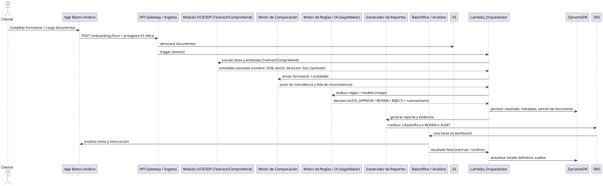
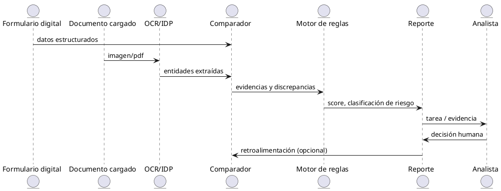

# Solución inteligente de Onboarding Digital — Banco Andino

> Proyecto: Automatización de detección de inconsistencias entre formularios digitales y documentos cargados por clientes

---

## Índice

1. Resumen ejecutivo
2. Objetivos
3. Alcance
4. Arquitectura propuesta (texto + diagramas)
   - Diagrama de secuencia (PlantUML)
   - Diagrama de interacción de entidades (PlantUML)
   - Arquitectura en AWS (código Python con librería `diagrams`)
5. Componentes, flujos y contratos de datos
6. Reglas de comparación y motor de IA
7. Consideraciones de seguridad, auditoría y cumplimiento
8. Esquema de almacenamiento y estructuras recomendadas
9. Flujo de revisión humana y dashboard de analistas
10. Pruebas, métricas e indicadores (SLOs, SLA, KPIs)
11. Despliegue y entregables (instrucciones para Cursor)
12. Archivos incluidos en el proyecto

---

## 1. Resumen ejecutivo

Esta solución automatiza la verificación de consistencia entre los **formularios digitales** (datos ingresados por el solicitante) y los **documentos** que carga (identificación, comprobante de domicilio, etc.) durante el onboarding de personas naturales. Usa servicios gestionados de AWS para OCR/IDP, NLP, orquestación serverless y un motor de reglas + modelos ML para decidir si se requiere intervención humana.

**Beneficios clave:** reducción de errores manuales, menor tiempo de validación, trazabilidad completa para auditoría KYC/AML/SARLAFT y escalabilidad.

---

## 2. Objetivos

- Mejorar la calidad y veracidad de la información ingresada por clientes.
- Detectar automáticamente inconsistencias (p. ej. nombre, fecha de nacimiento, número de documento, dirección) entre formulario y documento.
- Clasificar hallazgos según riesgo (bajo / medio / alto) y generar alertas/reports.
- Integrar flujo de revisión humana con trazabilidad.
- Mantener cumplimiento con regulaciones KYC/AML y requerimientos de auditoría.

---

## 3. Alcance

- Onboarding de personas naturales (no jurídico).
- Documentos soportados: cédula/ID, pasaporte, comprobante de domicilio, foto selfie para verificación biométrica.
- Mecanismos de verificación OCR, extracción de entidades (IDP), comparación de campos, reglas de negocio y modelos de ML para casos complejos.

---

## 4. Arquitectura propuesta

### Visión general (capas)

- **Capa Cliente**: App web / móvil para onboarding (autenticación con Cognito).
- **Capa de Entrada**: API Gateway recibe formularios y documentos (multipart/form-data o JSON con enlaces a S3 presigned).
- **Capa de Almacenamiento**: S3 (documentos originales y versiones), DynamoDB (formularios, resultados de análisis), KMS para cifrado.
- **Capa de Procesamiento Inteligente**: Lambda (orquestador), Textract / Rekognition para OCR/IDP, Comprehend / SageMaker para NLP e inferencias personalizadas.
- **Motor de Comparación**: Lambda comparador que normaliza campos y aplica puntaje de similitud.
- **Motor de Reglas / IA**: Lambda + SageMaker donde reglas determinísticas se combinan con modelos ML (p. ej., detección de fraude, verificación de nombres, similitud fonética/ortográfica).
- **Reportes & Alertas**: Generador de reportes (Lambda), colas/notifications (SQS/SNS), dashboard para analistas.
- **Revisión Humana**: Aplicación backoffice con vistas de evidencia y acción (aceptar, rechazar, solicitar más info).
- **Seguridad & Auditoría**: IAM, KMS, CloudWatch Logs/Alarms, AWS Config, CloudTrail.

### Diagrama de secuencia (PlantUML)



> Nota: puedes renderizar el `PlantUML` en Cursor o en cualquier generador PlantUML para obtener la imagen.

### Diagrama de interacción de entidades (PlantUML)



### Arquitectura en AWS — Diagrama con `diagrams` (Python)

Incluyo aquí un script listo para ejecutarse localmente (requiere `diagrams` y `graphviz`).

```python
# file: infra/diagrams_architecture.py
from diagrams import Diagram, Cluster
from diagrams.aws.security import Cognito, Kms
from diagrams.aws.compute import Lambda
from diagrams.aws.network import Apigateway
from diagrams.aws.storage import S3
from diagrams.aws.database import Dynamodb
from diagrams.aws.analytics import Sqs, Sns
from diagrams.aws.management import Cloudwatch, Iam
from diagrams.aws.ml import Rekognition, Comprehend, Sagemaker

with Diagram("Banco Andino Onboarding Architecture", show=False):
    with Cluster("Cliente & Ingreso"):
        client = Cognito("Auth (Cognito)")
        api = Apigateway("API Gateway")

    with Cluster("Storage"):
        s3 = S3("S3 - documentos")
        db = Dynamodb("DynamoDB - formularios/resultados")

    with Cluster("Procesamiento Inteligente"):
        ocr = Rekognition("Rekognition/Textract")
        nlp = Comprehend("Comprehend")
        model = Sagemaker("SageMaker")
        compare = Lambda("Comparador (Lambda)")
        orchestrator = Lambda("Orquestador (Lambda)")

    with Cluster("Reportes & Alertas"):
        report = Lambda("Generador de reportes")
        queue = Sqs("SQS")
        notify = Sns("SNS")

    security = Iam("IAM")
    kms = Kms("KMS")
    cw = Cloudwatch("CloudWatch")

    client >> api >> orchestrator
    api >> s3
    orchestrator >> ocr
    orchestrator >> nlp
    ocr >> compare
    nlp >> compare
    compare >> model
    compare >> db
    orchestrator >> report >> notify
    notify >> queue
    security - orchestrator
    kms - s3
    cw << orchestrator
```

> Ejecutar: `python infra/diagrams_architecture.py` (asegúrate de tener `diagrams` y `graphviz` instalados).

---

## 5. Componentes, flujos y contratos de datos

### Contrato de formulario (ejemplo JSON)

```json
{
  "request_id": "uuid-v4",
  "submitted_at": "2025-10-29T12:34:56Z",
  "person": {
    "first_name": "Juan",
    "last_name": "Pérez",
    "date_of_birth": "1985-05-15",
    "document_type": "CÉDULA",
    "document_number": "12345678",
    "address": "Calle 123 #45-67"
  },
  "documents": [
    { "type": "ID_FRONT", "s3_key": "s3://bucket/path/id_front.jpg" },
    { "type": "ID_BACK", "s3_key": "s3://bucket/path/id_back.jpg" },
    { "type": "PROOF_ADDRESS", "s3_key": "s3://bucket/path/bill.pdf" }
  ],
  "channel": "mobile"
}
```

### Resultado de OCR/IDP (ejemplo)

```json
{
  "request_id": "uuid-v4",
  "document_id": "s3://...",
  "entities": {
    "name": "JUAN PEREZ",
    "date_of_birth": "1985-05-15",
    "document_number": "12345678",
    "address": "CALLE 123 #45-67",
    "face_hash": "base64..."
  },
  "confidence": {
    "name": 0.98,
    "document_number": 0.95
  }
}
```

### Resultado comparador (ejemplo)

```json
{
  "request_id": "uuid-v4",
  "matches": [
    { "field": "name", "form_value": "Juan Pérez", "doc_value": "JUAN PEREZ", "similarity": 0.98 },
    {
      "field": "document_number",
      "form_value": "12345678",
      "doc_value": "12345679",
      "similarity": 0.92
    }
  ],
  "flags": ["document_number_mismatch"],
  "overall_score": 0.94
}
```

---

## 6. Reglas de comparación y motor de IA

### Reglas determinísticas (ejemplos)

- Normalizar texto: eliminar acentos, mayúsculas, filtros de caracteres.
- Comparación numérica exacta para campos como `document_number`.
- Similaridad por Levenshtein o `fuzzywuzzy` para `name` y `address`.
- Umbrales:
  - `similarity >= 0.95` → match
  - `0.80 <= similarity < 0.95` → probable match (requiere revisión rápida)
  - `similarity < 0.80` → mismatch (requiere revisión humana)

### Motor de IA

- Usar modelos en SageMaker para:
  - Determinar riesgo compuesto (feature set: similarity scores, confidence OCR, metadata del dispositivo, geolocalización, historiales de fraude).
  - Aprendizaje supervisado (clasificar `AUTO_APPROVE`, `REVIEW`, `REJECT`).
- Explicabilidad: modelos ligeros (XGBoost, LightGBM) con SHAP para explicar decisiones en el dashboard.

---

## 7. Consideraciones de seguridad, auditoría y cumplimiento

- **Cifrado en reposo y en tránsito:** KMS para cifrado SSE-KMS de S3, DynamoDB con cifrado.
- **Principio de menor privilegio:** roles IAM por servicio con políticas limitadas.
- **Registro y retención:** CloudTrail + CloudWatch Logs para todas las invocaciones y cambios en configuración.
- **Trazabilidad:** cada `request_id` enlaza formulario, documentos, versiones de modelos y decisiones.
- **Retención de datos personales:** política configurable según regulación local (ej. 5 años), y funciones para borrado/evaluación de requests.
- **Protecciones anti-automation:** rate-limits en API Gateway, verificación de device fingerprint.

---

## 8. Esquema de almacenamiento y estructuras recomendadas

### S3 (naming)

- `s3://bank-andino-onboarding/{env}/{year}/{month}/{request_id}/{document_type}/{filename}`
- Habilitar `ObjectLock` para evidencias críticas si aplica.

### DynamoDB (tablas)

- `OnboardingRequests` (PK: `request_id`, SK: `metadata`)
- `OnboardingResults` (PK: `request_id`) — almacena resultados de OCR, comparador y decisión
- Índices secundarios para `status`, `created_at`, `risk_level`

---

## 9. Flujo de revisión humana y dashboard

- Tareas en cola (SQS) para analistas con prioridad por riesgo.
- Dashboard (React/Next.js) con:
  - Visualización del formulario lado a lado con imagen del documento
  - Resumen de discrepancias y scores
  - Explicación del modelo (SHAP summary) para decisiones IA
  - Acciones: `Approve`, `Reject`, `Request More Documents`, `Escalar`
- Auditoría: cada acción queda registrada con `analyst_id`, timestamp y comentarios.

---

## 10. Pruebas, métricas e indicadores

- **KPIs recomendados:** reducción de tiempo medio de onboarding, % de casos auto-aprobados, tasa de falsos positivos/negativos, tiempo medio de revisión humana.
- **Testing:** dataset etiquetado para entrenamiento y validación; pruebas E2E en entorno `staging` con ejemplos reales anonimizados.

---

## 11. Despliegue y entregables (instrucciones para Cursor)

### Estructura de proyecto sugerida

```
bank-andino-onboarding/
├─ README.md
├─ infra/
│  └─ diagrams_architecture.py
├─ plantuml/
│  ├─ sequence.puml
│  └─ entities.puml
├─ src/
│  ├─ lambda_orchestrator/
│  │  └─ handler.py
│  ├─ lambda_compare/
│  │  └─ handler.py
│  └─ lambda_report/
│     └─ handler.py
├─ docs/
│  └─ security_and_compliance.md
└─ samples/
   ├─ sample_form.json
   └─ sample_ocr_result.json
```

### Cómo importar en Cursor

1. Crea un nuevo proyecto en Cursor.
2. Copia este `README.md` en la raíz del proyecto.
3. Crea las carpetas `infra`, `plantuml`, `src`, `docs`, `samples` y pega los archivos de ejemplo provistos.
4. Ejecuta `python infra/diagrams_architecture.py` para generar la imagen del diagrama (requiere instalar `diagrams`).

---

## 12. Archivos incluidos en este proyecto (contenido a crear automáticamente)

- `README.md` (este archivo)
- `infra/diagrams_architecture.py` (diagramas de infra)
- `plantuml/sequence.puml` (PlantUML del diagrama de secuencia)
- `plantuml/entities.puml` (PlantUML del diagrama de entidades)
- `src/lambda_orchestrator/handler.py` (esqueleto Lambda)
- `src/lambda_compare/handler.py` (esqueleto comparador con fuzzy)
- `src/lambda_report/handler.py` (esqueleto generador de reportes)
- `samples/sample_form.json` y `samples/sample_ocr_result.json`

A continuación incluyo plantillas de los archivos clave para que puedas copiar/pegar en tu proyecto.

---

### plantuml/sequence.puml


---

### plantuml/entities.puml


---

### src/lambda_orchestrator/handler.py

```python
import json
import boto3

dynamodb = boto3.resource('dynamodb')
# tabla = dynamodb.Table('OnboardingResults')

def lambda_handler(event, context):
    # evento: contiene request_id, s3_keys y payload del formulario
    print("Evento recibido:", json.dumps(event))
    # 1) llamar a Textract/Rekognition -> mock
    # 2) llamar a Lambda comparador (o función interna)
    # 3) llamar a SageMaker para scoring
    # 4) persistir resultados en DynamoDB
    return {"statusCode": 200, "body": json.dumps({"message":"Procesado"})}
```

---

### src/lambda_compare/handler.py (esqueleto con fuzzy)

```python
import json
from rapidfuzz import fuzz

THRESH_HIGH = 95
THRESH_MED = 80

def compare_field(form_value, doc_value):
    # normalizar
    if not form_value or not doc_value:
        return 0
    score = fuzz.ratio(form_value.strip().upper(), doc_value.strip().upper())
    return score


def lambda_handler(event, context):
    form = event.get('form')
    entities = event.get('entities')
    results = []
    for field in ['name','document_number','address']:
        fval = form.get(field)
        dval = entities.get(field)
        score = compare_field(fval, dval)
        results.append({'field': field, 'form_value': fval, 'doc_value': dval, 'score': score})
    return {'request_id': event.get('request_id'), 'matches': results}
```

---

### src/lambda_report/handler.py

```python
import json
import boto3

sns = boto3.client('sns')

def lambda_handler(event, context):
    # recibe decision y evidencia
    print('Generando reporte')
    # publicar en SNS si es necesario
    return {'status': 'ok'}
```

---

## Notas finales y recomendaciones rápidas

- **Versiona** tus modelos y reglas en un registro (S3 + DynamoDB / Model Registry de SageMaker).
- **Shadow mode:** despliega el motor IA en paralelo (shadow) antes de imponer decisiones automáticas.
- **Feedback loop:** captura decisiones humanas para retrain del modelo y ajustar umbrales.
- **Pruebas con datos reales pero anonimizados** para validar false positives.

---

Si quieres, puedo también:

- Generar las imágenes PNG/SVG del PlantUML aquí mismo.
- Crear los archivos reales en el repositorio de Cursor (copiar/pegar las plantillas).
- Proveer un `sam template` o `cdk`\_stack para desplegar los Lambdas y recursos.

---

_Fin del archivo README.md — Proyecto Banco Andino Onboarding_
