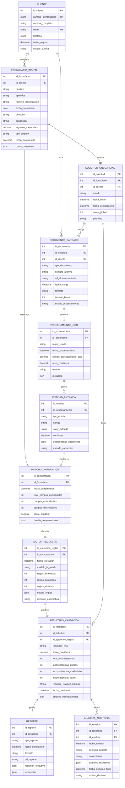

# Diagrama ER - Sistema de Onboarding Banco Andino

```mermaid
erDiagram

    CLIENTE ||--o{ FORMULARIO_DIGITAL : completa

    CLIENTE ||--o{ DOCUMENTO_CARGADO : sube

    FORMULARIO_DIGITAL ||--|| SOLICITUD_ONBOARDING : genera

    SOLICITUD_ONBOARDING ||--o{ DOCUMENTO_CARGADO : incluye

    DOCUMENTO_CARGADO ||--|| PROCESAMIENTO_OCR : procesa

    PROCESAMIENTO_OCR ||--o{ ENTIDAD_EXTRAIDA : genera

    FORMULARIO_DIGITAL ||--|| MOTOR_COMPARACION : ingresa_a

    ENTIDAD_EXTRAIDA ||--|| MOTOR_COMPARACION : ingresa_a

    MOTOR_COMPARACION ||--|| MOTOR_REGLAS_IA : alimenta

    MOTOR_REGLAS_IA ||--|| RESULTADO_VALIDACION : produce

    RESULTADO_VALIDACION ||--|| REPORTE : genera

    RESULTADO_VALIDACION ||--o{ ANALISTA_AUDITORIA : revisa

    SOLICITUD_ONBOARDING ||--o{ RESULTADO_VALIDACION : tiene


    CLIENTE {

        int id_cliente PK

        string numero_identificacion UK

        string nombre_completo

        string email UK

        string telefono

        datetime fecha_registro

        string estado_cuenta

    }


    FORMULARIO_DIGITAL {

        int id_formulario PK

        int id_cliente FK

        string nombre

        string apellidos

        string numero_identificacion

        date fecha_nacimiento

        string direccion

        string ocupacion

        decimal ingresos_mensuales

        string tipo_empleo

        datetime fecha_completado

        json datos_completos

    }


    SOLICITUD_ONBOARDING {

        int id_solicitud PK

        int id_formulario FK

        int id_cliente FK

        string estado

        datetime fecha_inicio

        datetime fecha_actualizacion

        int score_global

        string prioridad

    }


    DOCUMENTO_CARGADO {

        int id_documento PK

        int id_solicitud FK

        int id_cliente FK

        string tipo_documento

        string nombre_archivo

        string url_almacenamiento

        datetime fecha_carga

        string formato

        int tamano_bytes

        string estado_procesamiento

    }


    PROCESAMIENTO_OCR {

        int id_procesamiento PK

        int id_documento FK

        string motor_usado

        datetime fecha_procesamiento

        decimal tiempo_procesamiento_seg

        decimal nivel_confianza

        string estado

        json metadata

    }


    ENTIDAD_EXTRAIDA {

        int id_entidad PK

        int id_procesamiento FK

        string tipo_entidad

        string campo

        string valor_extraido

        decimal confianza

        json coordenadas_documento

        string metodo_extraccion

    }


    MOTOR_COMPARACION {

        int id_comparacion PK

        int id_formulario FK

        datetime fecha_comparacion

        int total_campos_comparados

        int campos_coincidentes

        int campos_discrepantes

        decimal score_similitud

        json detalle_comparaciones

    }


    MOTOR_REGLAS_IA {

        int id_ejecucion_reglas PK

        int id_comparacion FK

        datetime fecha_ejecucion

        string modelo_ia_usado

        int reglas_evaluadas

        int reglas_cumplidas

        int reglas_violadas

        json detalle_reglas

        string decision_automatica

    }


    RESULTADO_VALIDACION {

        int id_resultado PK

        int id_solicitud FK

        int id_ejecucion_reglas FK

        string resultado_final

        decimal score_confianza

        int total_inconsistencias

        int inconsistencias_criticas

        int inconsistencias_moderadas

        int inconsistencias_leves

        string requiere_revision_manual

        datetime fecha_resultado

        json detalles_inconsistencias

    }


    REPORTE {

        int id_reporte PK

        int id_resultado FK

        string tipo_reporte

        datetime fecha_generacion

        string formato

        string url_reporte

        json resumen_ejecutivo

        json evidencias

    }


    ANALISTA_AUDITORIA {

        int id_revision PK

        int id_resultado FK

        int id_analista FK

        datetime fecha_revision

        string decision_analista

        string comentarios

        json cambios_realizados

        datetime fecha_decision_final

        string motivo_decision

    }
```
